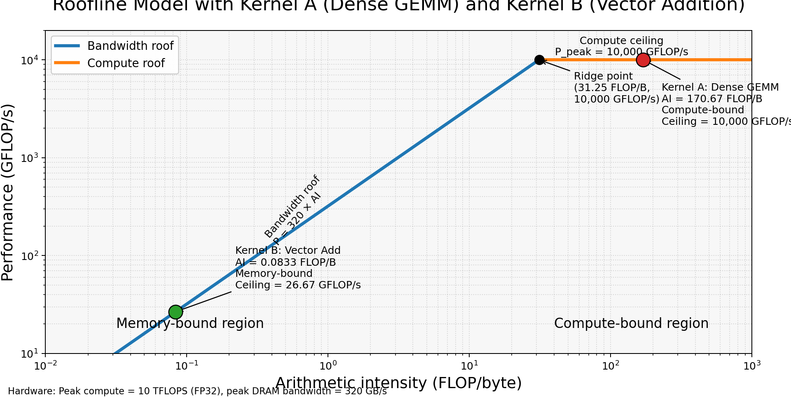

# Codefest CF02 Roofline Analysis

## Hardware specification

The roofline is constructed using the given hardware parameters:

- Peak compute = **10 TFLOP/s = 10,000 GFLOP/s**
- Peak DRAM bandwidth = **320 GB/s**

### Ridge point

```text
Ridge point = Peak compute / Peak bandwidth
            = 10,000 / 320
            = 31.25 FLOP/byte
```

Therefore:

- if `AI < 31.25 FLOP/byte`, the kernel is **memory-bound**
- if `AI > 31.25 FLOP/byte`, the kernel is **compute-bound**

---

## (a) Labeled roofline diagram

### Roofline equation

```text
P(AI) = min(10,000, 320 × AI)
```

Where:

- `AI` = arithmetic intensity (FLOP/byte)
- `P` = attainable performance (GFLOP/s)

### Ridge point coordinates

```text
(31.25 FLOP/byte, 10,000 GFLOP/s)
```

### Diagram



The plot shows:

- bandwidth-limited diagonal
- compute-limited ceiling
- ridge point
- Kernel A (Dense GEMM)
- Kernel B (Vector Addition)

---

## (b) Kernel A — Dense GEMM

Kernel A multiplies two FP32 matrices of size `1024 × 1024`.

### FLOPs

```text
FLOPs = 2 × N^3
```

With `N = 1024`:

```text
FLOPs = 2 × 1024^3
      = 2,147,483,648
```

### Bytes transferred

Each matrix contains:

```text
1024 × 1024 = 1,048,576 elements
```

Each FP32 element = 4 bytes.

Bytes per matrix:

```text
1,048,576 × 4 = 4,194,304 bytes
```

Traffic:

- A read = 4,194,304 bytes
- B read = 4,194,304 bytes
- C write = 4,194,304 bytes

Total:

```text
Bytes = 12,582,912
```

### Arithmetic intensity

```text
AI = FLOPs / Bytes
   = 2,147,483,648 / 12,582,912
   = 170.67 FLOP/byte
```

### Attainable performance

```text
P = min(10,000, 320 × 170.67)
  = 10,000 GFLOP/s
```

### Bound

```text
170.67 > 31.25
```

Kernel A is **compute-bound**.

### Architectural recommendation

Use a larger systolic or tensor-style MAC array because this kernel already has high arithmetic intensity and is limited by peak compute throughput.

---

## (c) Kernel B — Vector Addition

Kernel B adds two FP32 vectors of length `4,194,304`.

### FLOPs

```text
FLOPs = N
      = 4,194,304
```

### Bytes transferred

Each vector:

```text
4,194,304 × 4 = 16,777,216 bytes
```

Traffic:

- A read = 16,777,216 bytes
- B read = 16,777,216 bytes
- C write = 16,777,216 bytes

Total:

```text
Bytes = 50,331,648
```

### Arithmetic intensity

```text
AI = FLOPs / Bytes
   = 4,194,304 / 50,331,648
   = 0.08333 FLOP/byte
```

### Attainable performance

```text
P = min(10,000, 320 × 0.08333)
  = 26.67 GFLOP/s
```

### Bound

```text
0.08333 < 31.25
```

Kernel B is **memory-bound**.

### Architectural recommendation

Increase memory bandwidth or reduce bytes moved per output because this kernel performs very little work per byte transferred.

---

## (d) Final comparison

| Kernel | FLOPs | Bytes | AI (FLOP/byte) | Attainable GFLOP/s | Bound |
|---|---:|---:|---:|---:|---|
| Dense GEMM | 2,147,483,648 | 12,582,912 | 170.67 | 10,000 | Compute-bound |
| Vector Add | 4,194,304 | 50,331,648 | 0.08333 | 26.67 | Memory-bound |

---

## Conclusion

Dense GEMM lies to the right of the ridge point and is compute-bound, so compute throughput improvements matter most. Vector addition lies far to the left of the ridge point and is memory-bound, so memory bandwidth improvements matter most.
